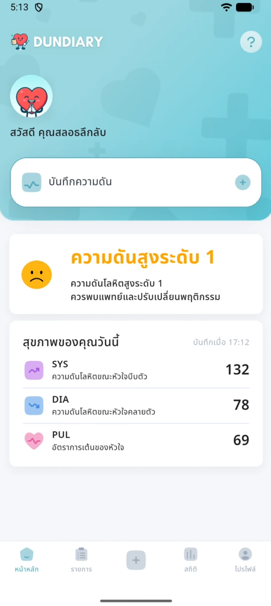
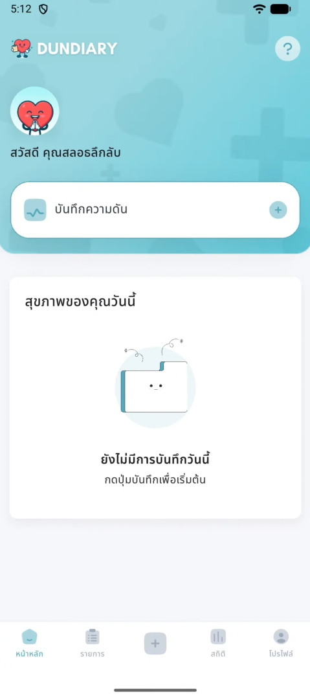
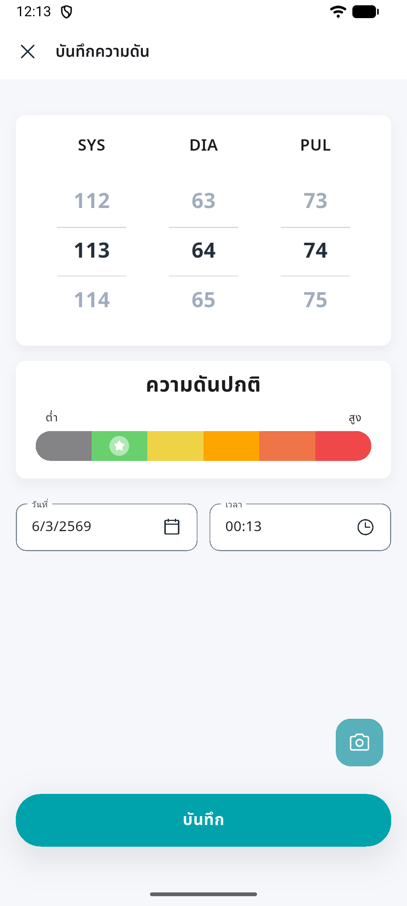
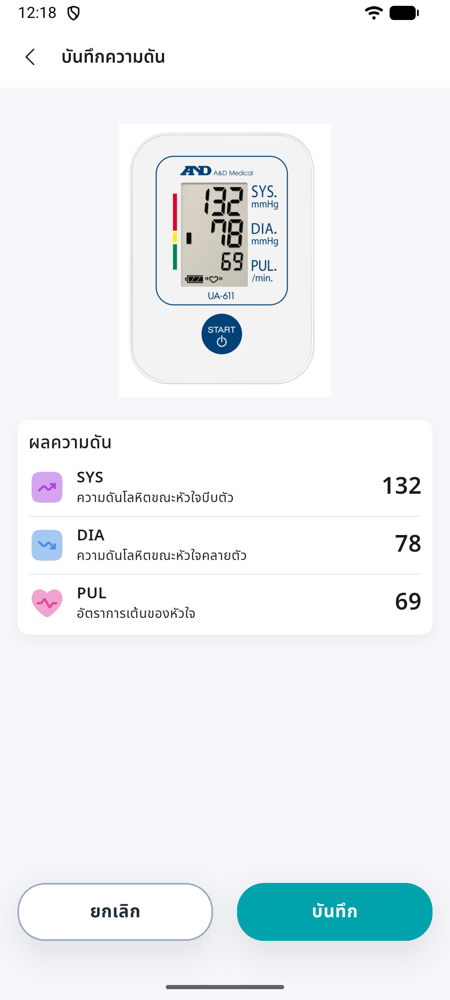
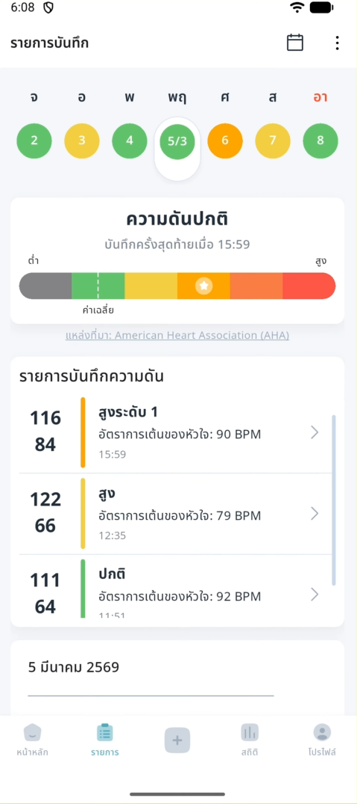
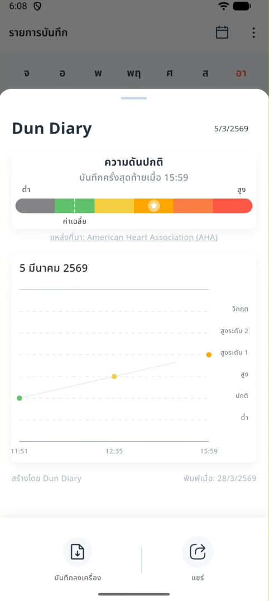
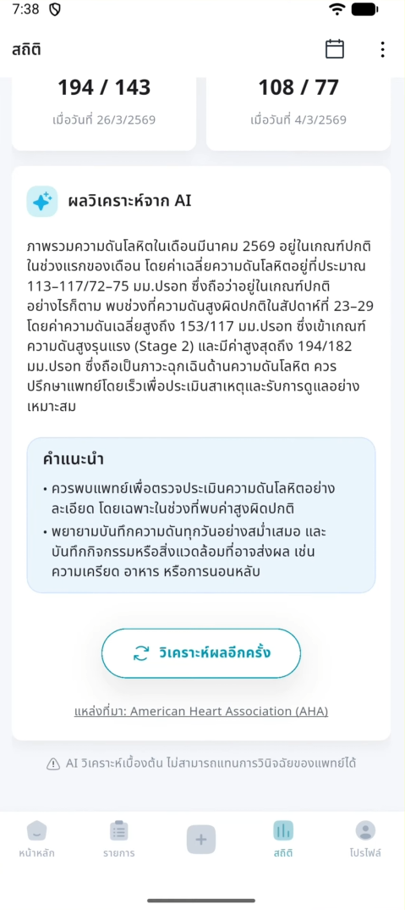
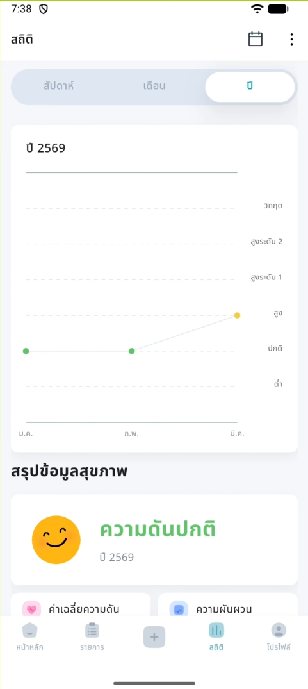
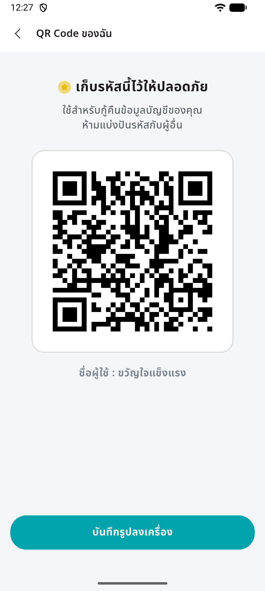
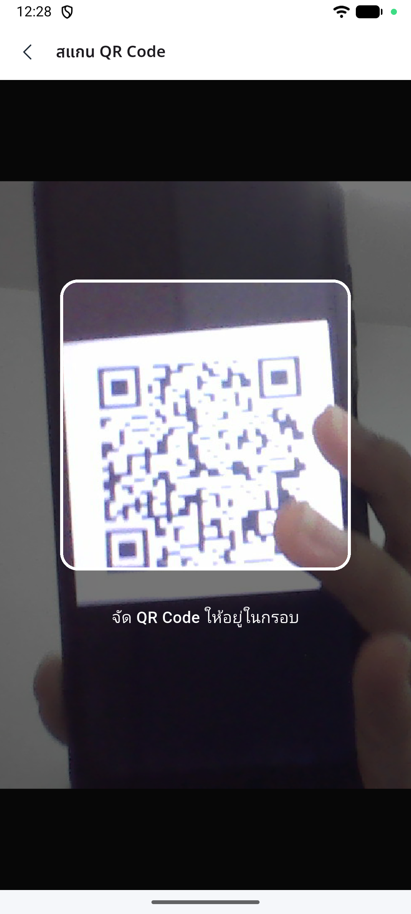

# 🩺 Dun Diary — Smart Blood Pressure Tracker

<p align="center">
  
</p>

<p align="center">
  <strong>Dun Diary</strong> is a smart blood pressure tracking app built with Flutter.<br/>
  It uses AI to read blood pressure monitor values from photos and provides personalized health analysis.
</p>

<p align="center">
  <a href="https://youtu.be/HA0Te8zUAJE">🎬 Watch Demo Video</a> •
  <a href="https://github.com/NutNaphop/Dun-Diary-Application/releases">📦 Download APK</a>
</p>

---

## 🎬 Demo

[](https://youtu.be/HA0Te8zUAJE)

> Click the image above to watch the full demo on YouTube

---

## ✨ Features

### 📷 AI-Powered Blood Pressure Recording
- Take a photo or pick an image of your blood pressure monitor — AI reads **Systolic**, **Diastolic**, and **Pulse** values automatically
- Uses a **YOLOv8** model (TFLite) for digit detection from monitor screens
- Manual input is also supported

### 📊 Statistics & Graphs
- Displays average, max, min values with fluctuation range
- Blood pressure trend graphs filterable by **day / week / month / year**
- Classifies blood pressure into 6 levels: *Low → Normal → Elevated → High Stage 1 → High Stage 2 → Crisis*

### 🤖 AI Health Analysis
- AI-generated health summaries and personalized recommendations
- Weekly blood pressure trend analysis
- Analysis results are cached locally to reduce redundant API calls

### 📅 Record History
- Calendar view showing days with recorded data
- Easy browsing and management of past records

### 🔐 Data Backup & Recovery
- QR code-based data backup & recovery (encrypted with **AES**)
- Scan QR codes to restore data on a new device

### 🔄 Offline-First & Cloud Sync
- Works fully **offline** — data is stored locally using Hive
- Syncs with **Cloud Firestore** when internet is available
- Built-in queue system for managing pending sync operations

---

## 📱 Screenshots

<div align="center">

### 🏠 Home

<table>
  <tr>
    <td align="center"></td>
    <td align="center"></td>
  </tr>
  <tr>
    <td align="center"><sub>Home — Empty State</sub></td>
    <td align="center"><sub>Home — Today's Health</sub></td>
  </tr>
</table>

### 📝 Record Blood Pressure

<table>
  <tr>
    <td align="center"></td>
    <td align="center"></td>
  </tr>
  <tr>
    <td align="center"><sub>Manual Input</sub></td>
    <td align="center"><sub>AI Photo Detection</sub></td>
  </tr>
</table>

### 📋 History

<table>
  <tr>
    <td align="center"></td>
    <td align="center"></td>
  </tr>
  <tr>
    <td align="center"><sub>Calendar View</sub></td>
    <td align="center"><sub>Day Detail & Graph</sub></td>
  </tr>
</table>

### 📊 Statistics & AI Analysis

<table>
  <tr>
    <td align="center"></td>
    <td align="center"></td>
  </tr>
  <tr>
    <td align="center"><sub>Weekly Statistics</sub></td>
    <td align="center"><sub>AI Health Analysis</sub></td>
  </tr>
</table>

### 🔐 Data Recovery

<table>
  <tr>
    <td align="center"></td>
    <td align="center"></td>
  </tr>
  <tr>
    <td align="center"><sub>QR Code Backup</sub></td>
    <td align="center"><sub>Scan to Restore</sub></td>
  </tr>
</table>

</div>

---

## 🛠️ Tech Stack

| Technology | Usage |
|---|---|
| **Flutter** 3.38.7 | Core framework |
| **Dart** SDK ^3.9.2 | Programming language |
| **Provider** | State management |
| **Hive** | Local storage (NoSQL) |
| **Firebase Auth** | Anonymous authentication |
| **Cloud Firestore** | Cloud database & sync |
| **Ultralytics YOLO** (TFLite) | Digit detection from images |
| **Lottie** | Animations |
| **Google Fonts** (NotoSansThai) | Thai typography |

---

## 🏗️ Architecture

The project follows a **Feature-based Architecture** with clear separation of concerns:

```
lib/
├── core/                  # Infrastructure
│   ├── auth/              # Firebase Anonymous Auth
│   ├── constant/          # Routes, Hive box names
│   ├── error/             # Error mapping & handling
│   ├── media/             # Image/media utilities
│   ├── network/           # Network client, API state, connectivity check
│   ├── recovery/          # QR code encryption & generation
│   ├── router/            # App navigation router
│   ├── services/          # Navigation, SnackBar, Sync services
│   └── mixins/            # Reusable mixins
│
├── data/                  # Data Layer
│   ├── blood_pressure/    # BP records (model, datasource, repository)
│   ├── analyze_record/    # AI analysis results & cache
│   └── user/              # User profile data
│
├── feature/               # Feature Modules
│   ├── home/              # Home — today's health overview
│   ├── record/            # Record BP (photo / manual input)
│   ├── history/           # Record history + calendar
│   ├── stat/              # Statistics + graphs + AI analysis
│   ├── setting/           # Settings, profile, data recovery
│   ├── main/              # Bottom navigation shell
│   └── splash_screen/     # Splash screen
│
├── shared/                # Shared Resources
│   ├── constant/          # App strings, colors, themes
│   ├── style/             # Text & component styles
│   ├── utils/             # Utility functions & helpers
│   └── widgets/           # Reusable UI components
│
└── main.dart              # Entry point
```

Each **Feature Module** is organized into:
- `presentation/` — Screens & Widgets
- `provider/` — State management (ViewModel pattern via Provider)

The **Data Layer** follows:
- `model/` — Data models & Hive adapters
- `datasource/` — Local (Hive) & Remote (Firestore) data sources
- `repository/` — Abstraction layer between datasources and features

---

## 🚀 Getting Started

### Prerequisites

- **Flutter** 3.38.7 (managed via [FVM](https://fvm.app/))
- **Firebase Project** with Authentication (Anonymous) and Cloud Firestore enabled
- **Android Studio** or **VS Code**

### Installation

```bash
# 1. Clone the repository
git clone https://github.com/NutNaphop/Dun-Diary-Application.git
cd Dun-Diary-Application

# 2. Install FVM (if not already installed)
dart pub global activate fvm

# 3. Install the required Flutter version
fvm install

# 4. Install dependencies
fvm flutter pub get

# 5. Generate Hive adapters
fvm flutter pub run build_runner build --delete-conflicting-outputs
```

### Environment Setup

This project uses `--dart-define-from-file` for managing secrets.

1. Copy the example env file:
   ```bash
   cp env.example.json env.json
   ```

2. Fill in your values in `env.json`:
   ```json
   {
     "BASE_URL": "<your-api-base-url>",
     "QR_ENCRYPTION_KEY": "<your-32-char-encryption-key>",
     "QR_ENCRYPTION_IV": "<your-16-char-iv>"
   }
   ```

3. Run the app:
   ```bash
   fvm flutter run --dart-define-from-file=env.json
   ```

   Or press **F5** in VS Code (pre-configured via `.vscode/launch.json`).

### Firebase Setup

1. Create a Firebase project in the [Firebase Console](https://console.firebase.google.com/)
2. Enable **Authentication → Anonymous Sign-in**
3. Enable **Cloud Firestore**
4. Run `flutterfire configure` to generate `firebase_options.dart`
5. Place the Firebase config files in the correct locations:

   ```
   dun_diary_app/
   ├── android/app/google-services.json        ← Android config
   ├── ios/Runner/GoogleService-Info.plist      ← iOS config
   └── lib/firebase_options.dart                ← Flutter config (auto-generated)
   ```

   > ⚠️ These files are **git-ignored** for security. Each developer must generate or obtain them from the Firebase Console.

   | File | How to get it |
   |---|---|
   | `google-services.json` | Firebase Console → Project Settings → Android app → Download |
   | `GoogleService-Info.plist` | Firebase Console → Project Settings → iOS app → Download |
   | `firebase_options.dart` | Auto-generated by `flutterfire configure` |

---

## 🔄 CI/CD

This project uses **GitHub Actions** for automated builds:

| Workflow | Trigger | Output |
|---|---|---|
| **Staging** | Push to `develop` | Build APK → Deploy to **Firebase App Distribution** |
| **Production** | Push tag `v*` | Build APKs (split per ABI + universal) → **GitHub Release** |

### Creating a Release

```bash
git tag v1.0.0
git push origin v1.0.0
```

This will automatically build 4 APK variants and create a GitHub Release:

| APK | For |
|---|---|
| `arm64-v8a` | Most modern phones (recommended) |
| `armeabi-v7a` | Older 32-bit phones |
| `x86_64` | Emulator / Chromebook |
| `universal` | All devices (larger file size) |

---

## 📄 License

This project is for educational and personal use.